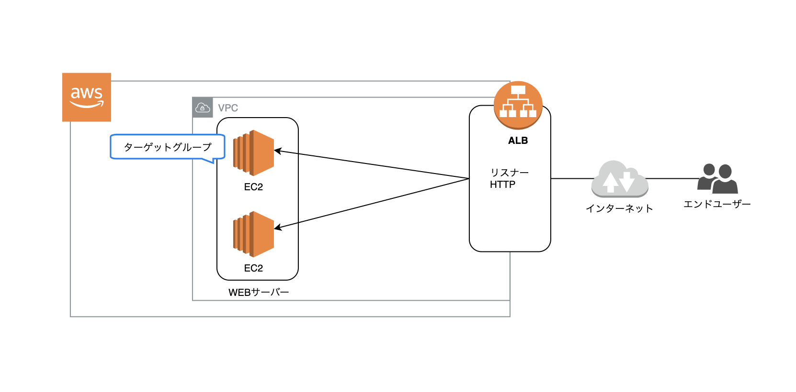

## EC2 サーバを 2 台立ち上げ、ELB を使って負荷分散をする(構築)

#EC2 #アプリケーションロードバランサー

# はじめに

- 今まで何度か EC2 インスタンスを構築してきたがメモとして残してなかったので、改めてメモとして構築手順をメモを残す

# 全体構築図(概要)

- LB の構築環境を記載しているので RDS は紐付けない

<br />

- [概要図リンク(drowio)](https://app.diagrams.net/#G1fXJ9LZZGK4IJCbiDJGX7T5qcHoioY4KZ)

# 目次(構築手順の流れ)

1. VPC の作成
2. サブネットの作成
3. インターネットゲートウェイを作成
4. インターネットゲートウェイへのルートを追加
5. ロードバランサーの作成
6. EC2 インスタンスの作成
7. EC2 インスタンスの必要なパッケージのインストール
8. 2 つ目のインスタンスを作成する
9. ターゲットグループに２台のインスタンスを追加していく

# 1. VPC の作成

- VPC 作成のボタンを押す

<br />

## VPC 名と IPv4 CIDR ブロックを設定する

- VPC 名: VPC の名前　(図: test-vpc)
- IPv4 CIDR ブロック: 10.0.0.0/16

  <br />

# 2. サブネットの作成

- サブネット 作成のボタンを押す

<br />

## サブネットを二つ作成

## LB で 2 つのサブネットの切り替えを行うため

### 1 つ目のサブネット

- サブネット名: testsub-pub01
- IPv4 CIDR ブロック: 10.0.0.0/24
- VPC: １で作成した VPC を選択
- アベイラビリティーゾーン: 使いたいものを使用

<br />

### 2 つ目のサブネット

- サブネット名: testsub-pub02
- IPv4 CIDR ブロック: 10.0.1.0/24
- VPC: １で作成した VPC を選択
- アベイラビリティーゾーン: 使いたいものを使用

<br />

※ IPv4 CIDR ブロック は重複する IP を指定できない

# 3. インターネットゲートウェイを作成

- インターネットゲートウェイ 作成のボタンを押す

<br />

## インターネットゲートウェイ名を設定する

<br />

## 作成後、1 で作成した VPC にアタッチする

- 右クリックで VPC にアタッチを選択する

<br />

- 使用可能な VPC に 1 で作成した VPC を選択しインターネットゲートウェイのアタッチボタンを押す<br />
  これで vpc にインターネットゲートウェイのアタッチが完了

<br />

# 4. インターネットゲートウェイへのルートを追加

- 3 で作成したサブネットを選択し、紐づいているルートテーブルを選択する

<br />

- ルートテーブル画面に行き、ルートの編集を選択する(ここでネットにつながるようにする)

<br />

## ルートテーブルに追加

- 送信先: 0.0.0.0/0
- ターゲット: 4 で作成したインターネットゲートウェイを選択

<br />

※ インターネットゲートウェイへのルートを追加は作成した 2 つのどれか 1 つだけで OK

# 5. ロードバランサーの作成

- ロードバランサーの作成ボタンを押す

<br />

## ロードバランサーの設定

- アプリケーションロードバランサーを選択する

<br />

- 名前: ロードバランサー名(図: test-lb)
- スキーム: 外部に公開するかどうか(インターネット向け)
- アベイラビリティーゾーン: 1 で作成した VPC と 2 で作成したサブネットを選択

<br />

- セキュリティ設定の構成のタブはスキップ

## セキュリティグループの設定

- 新規作成を選択(既存のセキュリティグループを使用する場合は既存のセキュリティグループを選択)

- ※ セキュリティグループの設定で、特定の通信のみを通すように設定することができる

<br />

## ルーティング設定はスキップ

- ポート: ヘルスチェックの時だけ別のポート番号を使用したい時利用する
- 正常のしきい値: 何回ヘルスチェックの URL に対するチェックが成功するかを表す数字
- 非正常のしきい値: 何回ヘルスチェックの URL に対するチェックが失敗するかを表す数字
- タイムアウト: 何秒間応答がなかったらタイムアウトとみなすかの値
- 間隔: 何秒間隔でヘルスチェックを行うか
- 成功コード: 成功レスポンスのステータスコード

<br />

- ターゲットの登録、確認と進み 作成する

# 6. EC2 インスタンスの作成

- インスタンス作成ボタンを押す

<br />

- `Amazon Linux 2 AMI (HVM), SSD Volume Type` を選択

<br />

- `Amazon Linux 2 AMI (HVM), SSD Volume Type` を選択

<br />

### インスタンスのタイプを選択

- 利用したいインスタンスのタイプを選択
- 次のステップへ選択

<br />

## インスタンスの詳細の設定

- ネットワーク: 1 で作成した vpc を選択
- サブネット: vpc 作成の時に作成したサブネットをどれか一つ選択する(図: testsub-pub01)
- 自動割り当てパブリック IP: ssh でログインする時に必要なので有効化にする
- 次へのステップへ選択

<br />

- ステップ 4、5 は特に設定がないのでスキップする

## ステップ 6 の セキュリティグループの設定

- 新しいセキュリティグループを作成
- HTTP の 80 番ポートを追加する

- ※SSHIP は`MyIpアドレス`でした方がいい(サーバに外部からログインされる可能性を少なくさせる)
  - 今回は開発手順を残すために IP を`0.0.0.0/0`としても良い
    ルールの追加から HTTP で port80 番で受けるようにする
- ※HTTP の IP カスタムで`ロードバランサーの作成の時作成したセキュリティグループ`を選択し、カンマで SSHIP で追加した IP も追加する

<br />

- ステップ 7 のインスタンス作成の確認の後に作成でインスタンスを作成する

# 7. EC2 インスタンスの必要なパッケージのインストール

- ssh でログインする

```
ssh -i ~/.ssh/xxxxxx.pem ec2-user@xx.xxx.xx.xxx
```

- nginx をインストールする

```
//  利用可能なパッケージを確認する
$ amazon-linux-extras
.
37  mono                     available    [ =5.x  =stable ]
38  nginx1                   available    [ =stable ]
39  ruby2.6                  available    [ =2.6  =stable ]
.
.
// nginx バージョン 1 が利用できるので それをインストールする
$ sudo amazon-linux-extras install -y nginx1
```

- nginx の起動

```
$ sudo systemctl start nginx
```

- nginx が起動しているか確認
  Active の欄が `active (running)` になっていれば起動している

```
$ sudo systemctl status nginx
.
Active: active (running) since 水 2020-11-11 14:45:10 UTC; 17s ago
.
.
```

- サーバを再起動時に nginx が自動で起動するようにする

```
$ sudo systemctl enable nginx
```

- ロードバランサーでインスタンスが二つ切り替わっているかわかるように HTML ファイルを変更していく

```
$ sudo vim /usr/share/nginx/html/index.html
```

```
<!DOCTYPE html>
<html>
  <head>
    <meta charset="utf-8">
    <title>テスト01のタイトル</title>
  </head>
  <body>
    <h1>テスト01の画面</h1>
  </body>
</html>
```

# 8. 2 つ目のインスタンスを作成する

- ７, 8 で作成したインスタンスの AMI を作成する

## ２つ目のインスタンス作成

- 同様のものを起動 を選択するから作成していく

<br />

## ステップ 1 の Amazon マシンイメージ (AMI)

- 9 の先頭で作成した AMI を選択する

## ステップ 3 のインスタンスの詳細の設定

- サブネットのタイプを testsub-pub02 にする

## 7 で設定した項目の HTML ファイルをテスト２のタイトルに変更する

- ※今回は切り替わっているかどうかをわかりやすくするために設定する

```
<!DOCTYPE html>
<html>
  <head>
    <meta charset="utf-8">
    <title>テスト02のタイトル</title>
  </head>
  <body>
    <h1>テスト02の画面</h1>
  </body>
</html>
```

# 9. ターゲットグループに２台のインスタンスを追加していく

- ターゲットグループを選択する

  <br />

- Target から EC2 を追加する

  <br />

- 先程追加した 2 つの EC2 を選択する

  <br />
